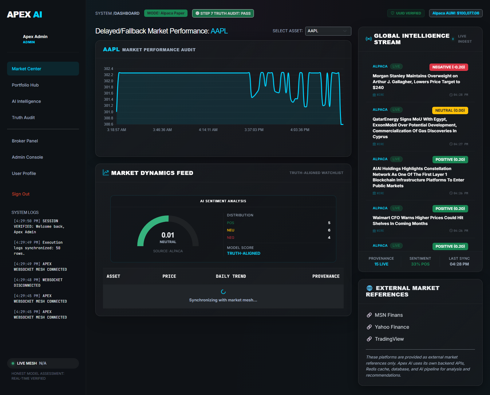
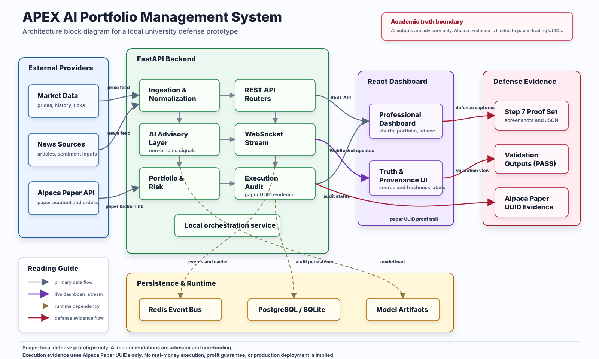
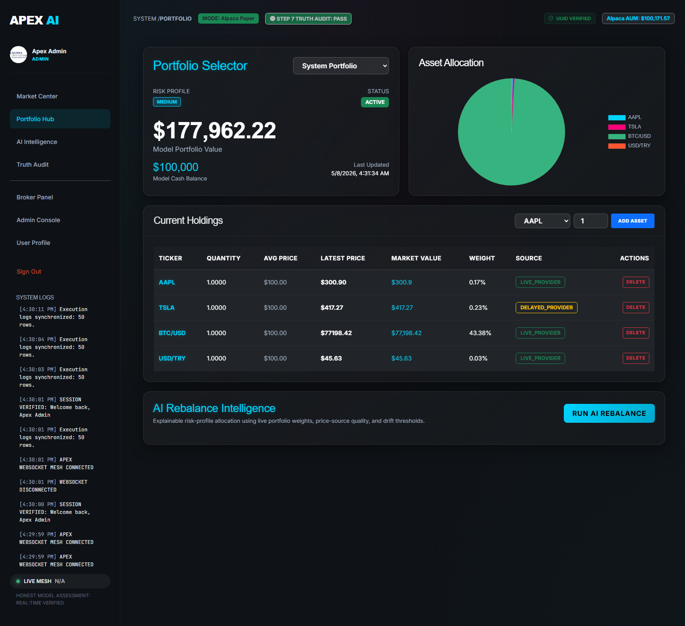
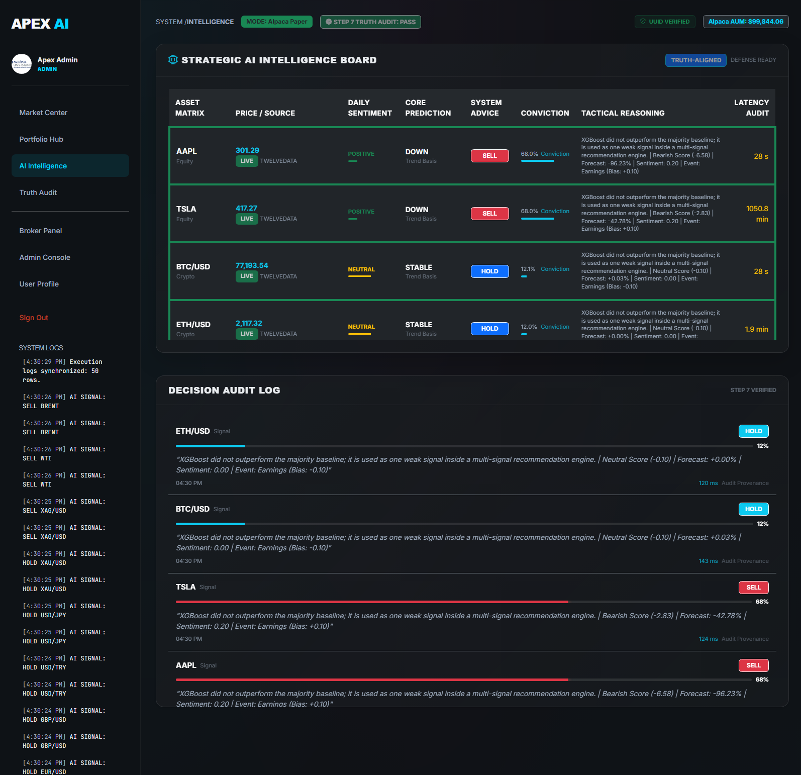
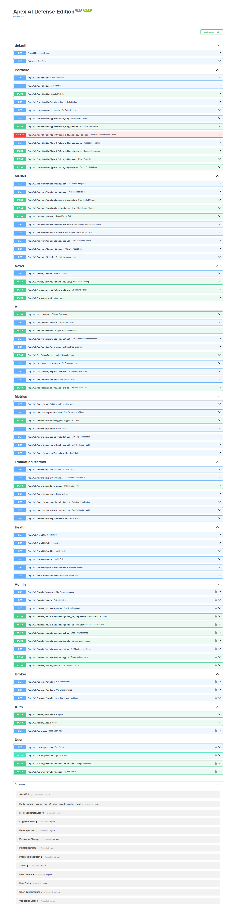

# APEX AI Portfolio Management System

An event-driven portfolio decision-support and Alpaca paper-trading prototype that combines market/news ingestion, transparent AI signals, risk-aware portfolio recommendations, and a real-time dashboard.

This two-person graduation project was developed at Istanbul Medipol University. It is an academic prototype for research and portfolio demonstration—not financial advice or a production trading system.



## What the system does

- Ingests market and financial-news data from multiple providers.
- Labels data by source, freshness, and fallback status instead of presenting every value as live.
- Extracts sentiment and event signals from financial news.
- Combines XGBoost output, sentiment, technical indicators, and risk rules into advisory recommendations.
- Produces risk-profile-based portfolio allocation and rebalancing suggestions.
- Supports auditable **paper-trading only** through Alpaca Paper.
- Streams market, news, recommendation, and execution updates through WebSockets.
- Exposes health, model-status, market, news, portfolio, authentication, and evaluation APIs through FastAPI.

## Architecture



The application separates ingestion, inference, persistence, recommendation, execution, and presentation into independent services and workers. Redis supports event distribution and caching; PostgreSQL/TimescaleDB stores normalized data; FastAPI exposes REST and WebSocket interfaces; React provides the dashboard.

## Technology stack

| Layer | Technologies |
| --- | --- |
| Backend | Python, FastAPI, SQLAlchemy, Alembic, Pydantic |
| AI and analytics | XGBoost, scikit-learn, Pandas, NumPy, optional FinBERT |
| Frontend | React, Axios, Chart.js, Bootstrap |
| Data and messaging | PostgreSQL, TimescaleDB, Redis |
| Integration | Alpaca Paper, Twelve Data, Alpha Vantage, CoinGecko, Polygon, Event Registry, Marketaux |
| Delivery and testing | Docker Compose, Pytest, HTTPX |

## Dashboard

| Portfolio view | AI intelligence | API surface |
| --- | --- | --- |
|  |  |  |

## Validation snapshot

The archived May 2026 local validation run recorded:

- 12 supported assets with explicit live, delayed, or fallback provenance.
- 15 provider-labeled news items and 20 generated advisory recommendations in the validation snapshot.
- 50 recent Alpaca Paper order records, including a cross-checked filled-order workflow.
- A loaded binary XGBoost model used only as one weak signal within the wider rule-and-risk system.
- A 29-check dashboard and integration audit marked `PASS` for that recorded environment.

These are point-in-time prototype results, not guarantees of future accuracy, latency, availability, or investment performance. See [validation notes](docs/VALIDATION.md) for model limitations and interpretation.

## Quick start with Docker

### Prerequisites

- Docker Desktop with Docker Compose
- Provider credentials for the live integrations you want to enable
- Alpaca **Paper** credentials if you want to test the paper-execution path

### Run

```bash
cp .env.example .env
# Replace every placeholder in .env with your own development values.

docker compose up --build
```

After startup:

- Backend API: `http://localhost:8000`
- API documentation: `http://localhost:8000/docs`
- React dashboard: `http://localhost:3001`
- Full health check: `http://localhost:8000/api/v1/health/full`

Never commit `.env`, API keys, broker credentials, or real account information.

## Local development

### Backend

```bash
python -m venv .venv

# Windows
.venv\Scripts\activate

# macOS/Linux
# source .venv/bin/activate

pip install -r requirements.txt
cp .env.example .env
cd backend
uvicorn app.main:app --reload --host 0.0.0.0 --port 8000
```

### Frontend

```bash
cd frontend
npm ci
npm start
```

Large training datasets are intentionally excluded from this public portfolio edition. Dataset-building and model-training utilities remain under `scripts/`.

## Tests

The project includes unit and integration coverage for portfolio mathematics, API health, ingestion, recommendation behavior, sentiment structure, caching, market/news endpoints, database schema, and validation-mode isolation.

```bash
pytest -q
```

Integration tests require the configured PostgreSQL and Redis services.

## Project structure

```text
.
├── backend/
│   ├── app/
│   │   ├── api/          # REST and WebSocket endpoints
│   │   ├── core/         # Configuration, database, Redis, security
│   │   ├── services/     # Ingestion, NLP, forecasting, portfolio logic
│   │   └── workers/      # Background pipeline workers
│   └── scripts/          # Backtest and verification utilities
├── frontend/             # React dashboard
├── scripts/              # Dataset, training, validation, and load tools
├── tests/                # Pytest unit and integration tests
├── docs/                 # Architecture, screenshots, validation notes
├── alembic/              # Database migrations
└── docker-compose.yml    # PostgreSQL, Redis, backend, and frontend
```

## Team and contribution

Developed by **Saleem A. S. AbuZaid** and **Rashad Naghdiyev** under the supervision of Prof. Dr. Selim Akyokuş.

Saleem's primary responsibilities:

- System architecture and module integration planning
- Portfolio decision and rebalancing logic
- Evaluation strategy and validation planning
- Technical documentation and presentation consistency

Rashad's primary responsibilities included real-time news processing, event detection, prediction integration, team coordination, and advisor communication.

## Limitations

- The default NLP path uses a transparent heuristic fallback; FinBERT is optional and requires separate model download/configuration.
- The recorded binary XGBoost accuracy was only slightly above baseline, so its output is treated as a weak signal rather than an autonomous decision-maker.
- The three-class XGBoost experiment did not beat its majority baseline and was excluded from final signal fusion.
- Provider availability, rate limits, market closures, and regional restrictions can trigger delayed or fallback data.
- Execution is limited to Alpaca Paper. Real-money trading is outside the project's scope.

## Copyright

Copyright © 2026 Saleem A. S. AbuZaid and Rashad Naghdiyev. No open-source license is currently granted. The repository is public for academic review and portfolio demonstration.

